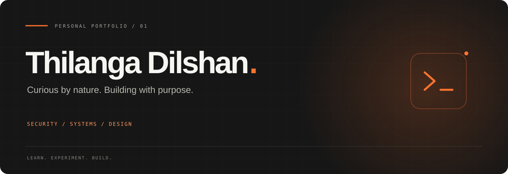

<div align="center">



**A cybersecurity student's space to explore, experiment, and build.**

A charcoal-and-orange portfolio bringing security, systems, and thoughtful web design together.


[Explore the code](dist) · [Run locally](#run-locally) · [Make it yours](#make-it-yours) · [GitHub profile](https://github.com/dilshansec)

</div>

## The experience

An animated introduction opens into a responsive, single-page portfolio. Subtle motion, technical lab panels, and a restrained color palette keep the focus on the work and the person behind it.

| Detail | What it brings |
| :--- | :--- |
| **Kinetic loading screen** | Outlined typography with a flowing white fill, orange accents, and a soft exit. |
| **Scroll reveals** | Content fades and rises into view again whenever you return to it. |
| **Interactive lab gallery** | Select a topic to bring its description and technology stack into focus. |
| **Floating navigation** | Active-section indicators, scroll progress, and a mobile menu. |
| **Monochrome ticker** | A continuous interests strip with softly faded edges. |
| **Responsive layouts** | Dedicated arrangements for desktop and smaller screens. |
| **Motion preferences** | Reduced-motion alternatives and keyboard focus support. |

## Inside the portfolio

- **Home** — introduction, cyber-themed artwork, and a personal statement.
- **About** — mindset, skills, and the tools behind the learning process.
- **Labs** — Linux, network discovery, web security, packet analysis, cloud foundations, secure development, and log investigation.
- **Journey** — a timeline for education, practice, projects, and continued learning.
- **Contact** — a message form and configurable contact channels.

> Lab topics are sample learning outlines. Education details and contact channels include placeholders to complete as the portfolio grows. The portrait is generated cyber artwork.

## Run locally

Install Node.js, then run:

```bash
git clone https://github.com/dilshansec/Portfolio.git
cd Portfolio
node server.cjs
```

Open **[http://127.0.0.1:4173](http://127.0.0.1:4173)**.

No package installation or build step is required. The preview server uses Node.js built-in modules and serves the files in `dist/`.

## Project map

```text
Portfolio/
├── dist/
│   ├── index.html           # Page structure and content
│   ├── styles.css           # Base styles and responsive foundations
│   ├── theme.css            # Charcoal/orange palette and interests strip
│   ├── section-layout.css   # Layout refinements
│   ├── script.js            # Navigation, dialogs, and repeat scroll reveals
│   ├── loader.css / .js     # Kinetic intro and loading lifecycle
│   ├── labs.css / .js       # Interactive sandbox cards and project data
│   ├── contact.css / .js    # Contact presentation and message handling
│   ├── effects.css / .js    # Motion and pointer lighting
│   ├── about.css            # About section
│   ├── journey.css          # Timeline
│   ├── navbar.css           # Desktop and mobile navigation
│   ├── footer.css           # Footer styling
│   └── assets/              # Portrait and favicon
├── docs/
│   └── readme-banner.svg    # Repository banner
├── server.cjs               # Local static preview server
└── README.md
```

## Make it yours

| Change | Edit |
| :--- | :--- |
| Name, introduction, timeline, and page metadata | `dist/index.html` |
| Colors and shared visual treatment | `dist/theme.css` and `dist/styles.css` |
| Lab titles, descriptions, technologies, and objectives | `labProjects` in `dist/labs.js` |
| Public email, GitHub, LinkedIn, and location | `portfolioContact` in `dist/contact.js` |
| Loading animation and timing | `dist/loader.css` and `dist/loader.js` |
| Portrait and browser icon | `dist/assets/` |

**Contact behavior:** with no email configured, the form copies the composed message to the clipboard. Setting an email opens a draft in the visitor's email app. It does not send messages through a backend.

**Navigation behavior:** refreshing returns the page to Home. Section links still work during normal navigation.

## Static hosting

The publish directory is **`dist/`**. It contains the website's HTML, styles, scripts, and assets; no production Node.js process is required. Keep the relative file paths intact when uploading it to a static host.

---

<div align="center">

**Think critically. Build securely. Keep exploring.**

[Thilanga Dilshan · @dilshansec](https://github.com/dilshansec)

</div>
